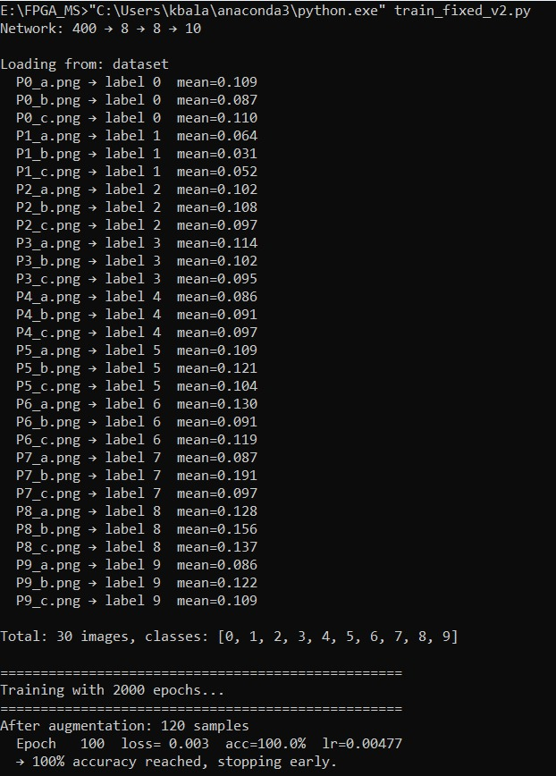
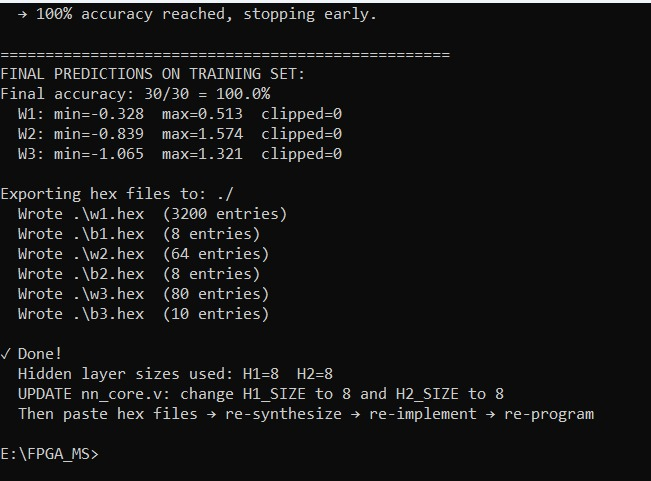
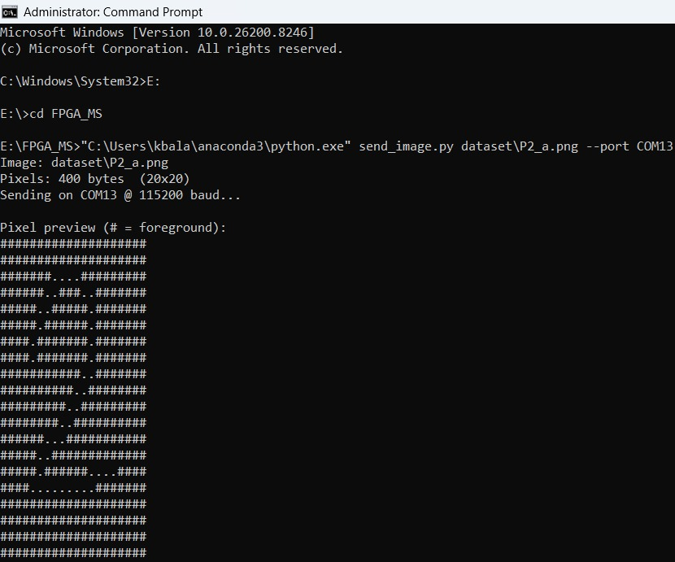
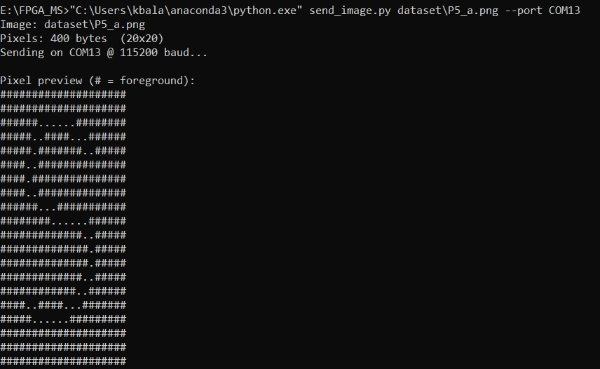
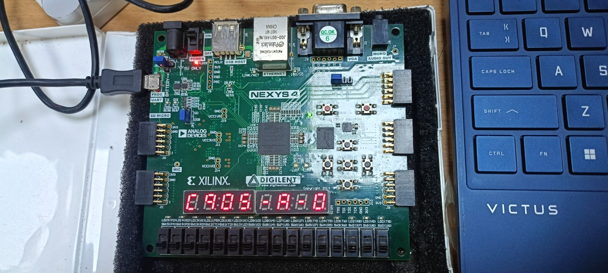

# FPGA Neural Network Image Recognition
### Hardware neural network accelerator on Xilinx Nexys4 FPGA
> Trained in Python → Weights exported as HEX → Deployed on FPGA via UART

---

## 🔍 Overview
A fully hardware-implemented neural network for real-time image 
recognition on Xilinx Nexys4 FPGA. Images are sent from PC to FPGA 
via UART serial communication. The FPGA runs a trained 3-layer neural 
network (400→8→8→10) entirely in hardware, classifying digits 0–9 
with **100% accuracy** on the training set.

---

## 🧠 System Architecture
- **Python Training Script** — Trains neural network, exports weights
- **send_image.py** — Sends 20x20 pixel images to FPGA via UART
- **uart_rx.v** — Receives pixel data from PC at 115200 baud
- **pixel_buffer.v** — Stores incoming pixel frame
- **nn_core.v** — Hardware neural network inference engine
- **seven_seg_ctrl.v** — Displays classification result on 7-segment
- **top.v** — Top-level integration module

---

## 🛠️ Tools & Hardware
| Item | Details |
|------|---------|
| HDL Language | Verilog |
| EDA Tool | Xilinx Vivado 2019.1 |
| FPGA Board | Nexys4 DDR (Artix-7) |
| Training | Python (Anaconda) |
| Communication | UART @ 115200 baud |
| Network Architecture | 400 → 8 → 8 → 10 |
| Dataset | 30 images, 10 classes (digits 0–9) |
| Accuracy | **100%** |

---

## 📁 Files
| File | Description |
|------|-------------|
| `top.v` | Top-level module integrating all components |
| `uart_rx.v` | UART receiver for serial image input |
| `pixel_buffer.v` | Frame buffer for incoming pixel data |
| `nn_core.v` | Neural network inference hardware core |
| `seven_seg_ctrl.v` | 7-segment display controller |
| `train_fixed_v2.py` | Python training script |
| `send_image.py` | Python UART image sender |
| `w1.hex / w2.hex / w3.hex` | Trained weight hex files |
| `b1.hex / b2.hex / b3.hex` | Trained bias hex files |

---

## ⚙️ How It Works

### Step 1 — Train on PC
```bash
python train_fixed_v2.py
```
Trains a 3-layer neural network on 30 images (3 per digit, 10 digits).
Exports weights and biases as `.hex` files for FPGA loading.

### Step 2 — Send Image via UART
```bash
python send_image.py dataset/P2_a.png --port COM13
```
Sends a 20x20 pixel image (400 bytes) to FPGA at 115200 baud.

### Step 3 — FPGA Classifies in Hardware
FPGA receives pixels, runs neural network inference, displays 
predicted digit on 7-segment display in real-time.

---

## 📊 Training Results
**Network:** 400 → 8 → 8 → 10
**Final Accuracy: 30/30 = 100%**





---

## 📡 UART Pixel Preview
Images sent to FPGA (ASCII pixel preview):

**Image P2_a.png:**



**Image P5_a.png:**



---

## 🔧 Hardware Demo — Nexys4 Board
Real-time digit classification running on FPGA hardware:



---

## 📐 Vivado Project Sources


---

## ✅ Key Results
- 100% classification accuracy on 10-class digit dataset
- Complete Python-to-FPGA pipeline implemented
- Neural network inference running fully in hardware
- Real-time result display on 7-segment display
- UART communication verified at 115200 baud
- Synthesized and implemented on Nexys4 DDR (Artix-7)

---

## 👤 Author
**Balajothi K**
ECE Pre-Final Year — Lovely Professional University
📧 kbalajothikathirvel@gmail.com
🔗 [LinkedIn](https://www.linkedin.com/in/balajothi-kathirvel/)
🐙 [GitHub](https://github.com/bala7415)
